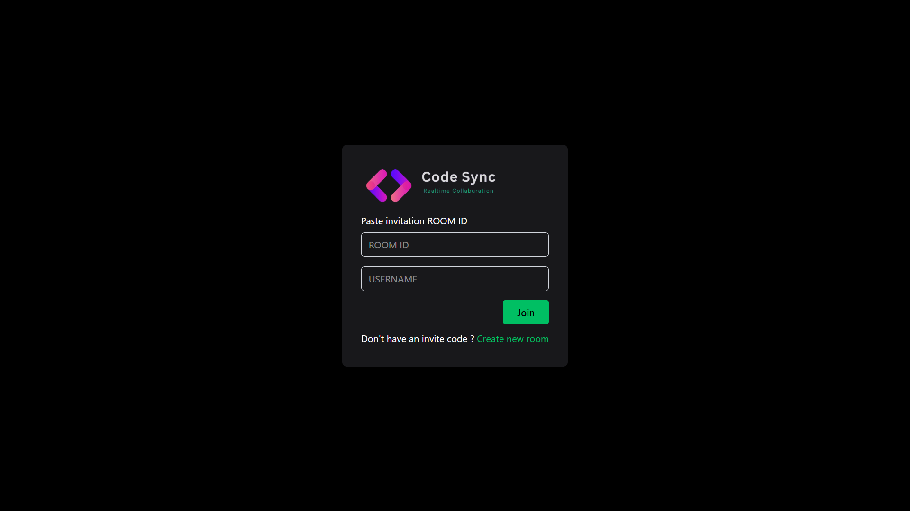
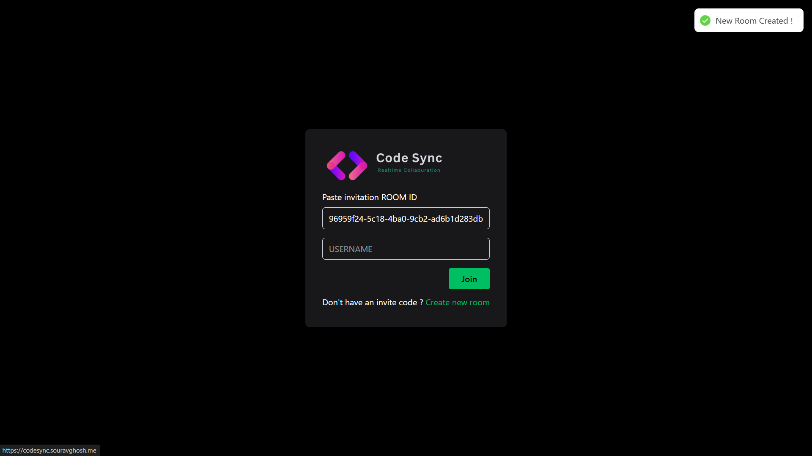
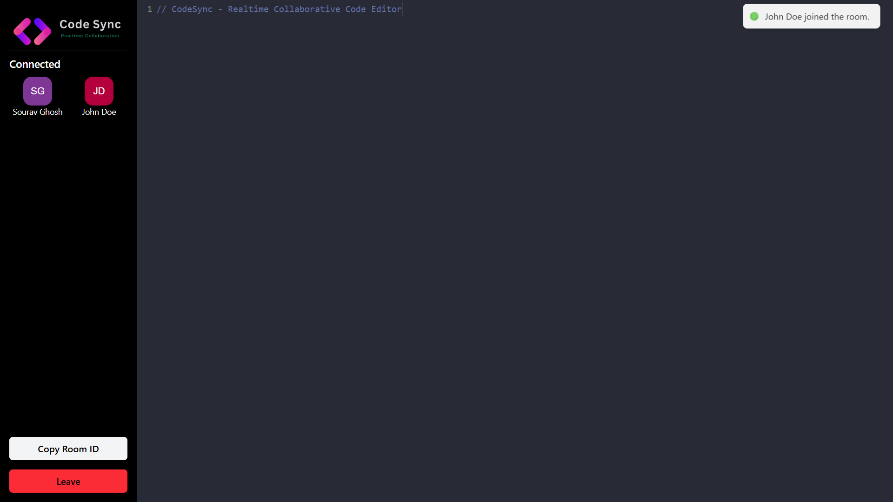
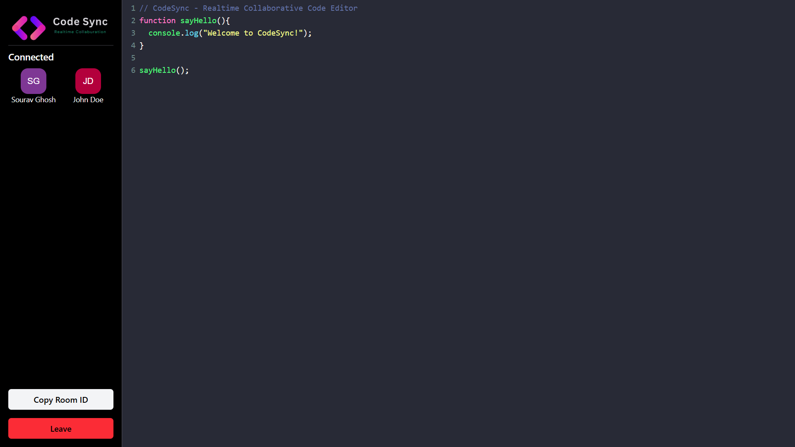
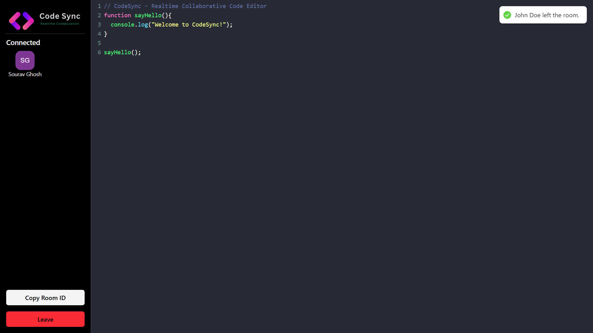

# 🚀 CodeSync – Real-Time Collaborative Code Editor

CodeSync is a web-based real-time collaborative code editor that allows multiple users to write and edit code simultaneously in a shared environment. Built using **React**, **CodeMirror**, **Socket.io**, and **Node.js**, it mimics the collaborative features of modern development platforms.

Live Demo: [Click here to try CodeSync](https://codesync.souravghosh.me)  

## ✨ Features

- 🧑‍💻 Real-time code collaboration using **WebSockets**
- 🔐 Unique room-based editing — join with a code
- 🧠 Powered by **CodeMirror** for a smooth coding experience
- ✅ Instant sync for all participants in a room
- 🔔 Toast notifications for user actions (join/leave/error)
- ☁️ Deployed using **Vercel** (frontend) and **Render** (backend)

## 📸 Screenshots

## 🛠️ Tech Stack

| Frontend  | Backend  | Other Tools        |
|-----------|----------|--------------------|
| React     | Node.js  | Socket.io (WebSockets) |
| Tailwind CSS | Express.js | CodeMirror (Editor) |
| Vercel (Deploy) | Render (Deploy) | Toastify, UUID |

## ❓ How It Works
1. A user creates or joins a room using a unique room ID.

2. Socket.io establishes a WebSocket connection.

3. Changes in the editor are emitted to the server and broadcast to all users in the room.

4. UI updates are reflected in real time across all connected users.

## 🧑‍💻 Author

**Sourav Ghosh**  
🌐 [Portfolio Website](https://souravghosh.me)  
🔗 [LinkedIn](https://linkedin.com/in/souravghosh121)  
🐙 [GitHub](https://github.com/souravghoshofficial)

## 💬 Feedback & Collaboration

I’m always open to feedback, suggestions, or collaboration ideas!

If you:
- Encounter bugs or issues 🐛
- Have ideas to improve CodeSync 💡
- Want to contribute 🤝
- Or just want to say hi 👋

Feel free to reach out via:

📧 Email: inbox.souravghosh@gmail.com  
🔗 [LinkedIn](https://linkedin.com/in/souravghosh121)  
🐙 [GitHub Issues](https://github.com/souravghoshofficial/codesync/issues)

Let's connect and build something awesome together 🚀

